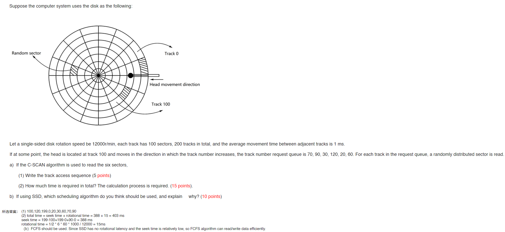

# Report8

- Answer the questions

    1. I/O control methods can be classified as (1)_______(2)__.
    2. Each physical record on the disk has a unique address that consists of three parts: (1)_______(2)_____________(3)_____________.
    3. Data READ/WRITE time = (1)_____________ + (2) ____________ +(3)____________.
    4. The metric for measuring I/O performance are (1)__________,(2)___________.
    
    - a(1) Programmed I/O (2) DMA
    
      b(1) head identifier (2) track identifier (3) sector identifier
    
      c(1)seek time (2) rotational latency (3) transfer time
    
      d(1) response time (2) throughput

- What are the work steps of the DMA controller? Please answer it and briefly describe the process of each step
  1. preparation. CPU will send necessary data to DMA controller to set the special bits and the information about the buffer and disk 
  2. transfer. After being allocated CPU resources, DMA controller transfer the data to the buffer until completion
  3. finish. When the input is finished, the DMA controller will interrupt the CPU to signal transfer completion.

- Under what circumstance, the SSTF algorithm will cause starvation?

  - When there is a request far away from the current position, and there are continuous requests that are close to the current position, the request far away may never be served. This can cause starvation.

    

